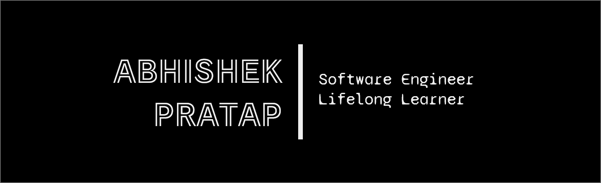

[](https://github.com/AbhishekPratap05)

</br>

### <div align="center" style="font-weight:700">  <h3>Hi there </h3></div>
### <div align="center"> My name is Abhishek Pratap - aka **AbhishekPratap05** working as a Web Developer 👨‍💻 for about **2+** years </div>

```
Abhishek_Pratap:.
│
├───Work_Experience👨‍💻
│   │
│   └───Refinitiv
│         2019-{new Date().getFullYear()}   
│
└───Education🎓
    │   
    ├───MCA(Master of Computer Application)
    │	  Duration:2016-2019
    │
    ├───BCA(Bachelor of Computer Application)
    │     Duration:2013-2016
    │
    └───12th
          Completed_2013
```

</br></br>

## About Me 😎
- 💻 I’m currently working on improving my Skills!
- 🌱 I’m currently learning to build API using GraphQL.
- 👯 I’m looking forward to contribute to open source community.
- 🥅 2021-2022 Goals: Learn Nextjs React-native-web GraphQL React-Query Firebase MongoDB.
- :man_office_worker: Work on projects and improve GitHub profile and learn in the process.
- ✏️ I am good at sketching and planning on painting soon.

</br></br>

## Languages and Tools 🛠
<div>
  
  
  
  
  
</div></br>
<div>
  
  

</div></br>
<div>
  
</div></br>
<div>
  
</div></br>
<div>
  
  
  
</div></br>
<div>


</div></br>
<div>

</div>

</br></br>

## Stats 📊
<a href="https://github.com/AbhishekPratap05">

</a>

<a href="https://github.com/AbhishekPratap05">

</a>

</br></br>

## <div align="left"> </div>

[](https://open.spotify.com/user/b8l3m9jybl9xuhri2bu2qxmlo)

</br></br>

## Connect with me 🤝
[][sendMail]
[][linkedin]
[][instagram]

</br>

[][duolingo] 

[instagram]: https://www.instagram.com/ap_abhishekpratap
[linkedin]: www.linkedin.com/in/abhishekpratap05121994
[sendMail]: mailto:pratap.5dec@gmail.com
[duolingo]: https://www.duolingo.com/profile/AbhishekPratap05
